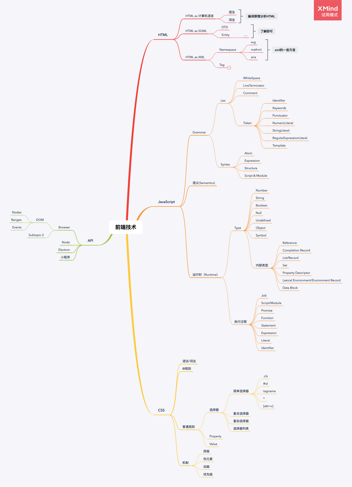

## 学习笔记

## 如果你要写一本关于整个前端开发的书，请你列出你的目录？

    首先来说，把整个前端开发融入一本书里，实在是难。因为涉及的太广。甚至一些小知识点汇集起来都能成一本书。而且写书肯定要有目标读者，本书默认目标读者不是前端小白，至少有一些编程基础。为了防止书籍太厚用来垫桌腿。所以我还是准备分几卷来写。如下：
    第一卷: 追溯篇
        了解历史很重要，这样让你更能明白JS为何会被设计成现在这个样子。当初Brendan Eich用了十天就写出来的语言，必定有很多不合理的地方。这些都是要在这篇讲清楚的。还有HTML和CSS的发展。
    第二卷: 基础篇
        2.0 JS基础
            2.1 类型
                首先讲讲JS的类型系统，讲讲JS为什么是静态类型的。对比Java的类型来讲讲。
            2.4 原型，原型链
            2.5 词法作用域和动态作用域和作用域链
            2.6 执行上下文
            2.7 JS的对象
            2.8 this
            2.9 闭包
            2.10 继承

        3.0 HTML基础
            3.1 HTML 文档的语义，结构，与API
            3.2 HTML元素
            知道HTML有什么元素和文档的语义结构， 在基础篇就差不多了。关于如何通信，web workers, web存储，渲染 放在进阶篇中。

        4.0 CSS基础
            4.1 盒模型
            4.2 各种选择器的使用
            4.3 各种布局的实现方式
                包括float position flex grid
            4.4 各个属性之间的影响

    第三卷: 框架篇
        流行框架的讲解，主要针对MV*的讲解。react、vue、angular的使用与原理。
    第四卷: 搭建篇
        也就是工程化，如何搭建可持续交付的的工程。 包括各个工具的选型。
    第五卷: 实战篇
        可视化方面项目: canvas、webgl、css
        通信方向的: websocket
        工具方向的等等等
    第六卷: 性能优化篇
        优化项目性能。并可以写出一些极端情况下的性能优化。
    第七卷: 架构篇
        补充内功， 设计模式，技术选型，大型网站如何架构。
    第八卷: 工具篇
        性能检测工具，自动化测试工具，日志工具，等等等
    第九卷: 原理源码篇
        浏览器原理
        V8引擎原理，部分C++源码
        各种JS内置对象如何实现
        流行框架源码
    第十篇: 职业规划篇

    内容实在太多 一些目录就没展开谈了。但每一卷都是一本书。

## 根据老师所列的知识体系的脑图，自己用老师所教授的追溯法，并通过理解将其补充完整，形成自己的知识体系

## 本周学习总结

系统性的整理了一下，整个前端的知识体系。并在整理的过程中发现编译原理的重要性。准备补充一下这部分知识，然后实现一些在工作中能用到的功能。